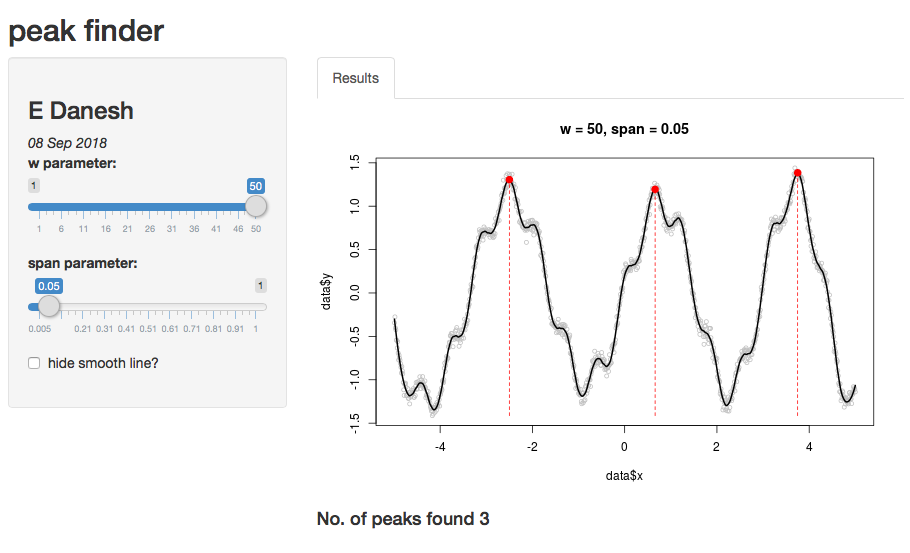

```{r setup, include=FALSE}
knitr::opts_chunk$set(echo = FALSE)
```

## Introduction

Here, I introduce a simple and fast Shiny application for deetcting peaks (local maxima) of a noisy data set. Fig. 1 shows a representative data which I use for this demo. Although not demonstrated here, this app can be used for noisy time series data too!

```{r fig.cap="Fig. 1 demo data", fig.align='center', echo=TRUE}
# Simulate noisy data
x <- 1:1000 / 100 - 5
y <- exp(abs(x) / 20) * sin(2 * x + (x / 5) ^ 2) + cos(10 * x) / 5 + 
        rnorm(length(x), sd = 0.05)
# Plot the data                                                                          
plot(x, y, cex = 0.75, col = "Gray")
```

## Algorithm

1. first step is to smooth data using loess() function from *stats* package, which fits a polynomial fit.

2. then, using rollapply() function from *zoo* package, a new curve is created that intersects with original curve at peak tips. This resampling makes each peak ‘wider’, so only tips of original peaks contact with the resampled curve.

3. finally, peaks are detected by comparing a local maximum filter to the smooth.

There are two tunable parameters in this app: 

-**w** is the half-width of the window used to compute the local maximum.

-**span** is an argument of the loess smoother.

## Application

link to the interactive app:
https://edanesh.shinyapps.io/project9/


Using parameters w=50 and span=0.05, the app successfully captured 3 peaks:
```{r, echo=FALSE, fig.cap="Fig. 2 app demo", out.width = '100%'}

```

## References

[1] Algorithm and code originally from William A. Huber
https://stats.stackexchange.com/questions/36309/how-do-i-find-peaks-in-a-dataset

[2] Illustrated in rpubs by Meng Xu
https://rpubs.com/mengxu/peak_detection

